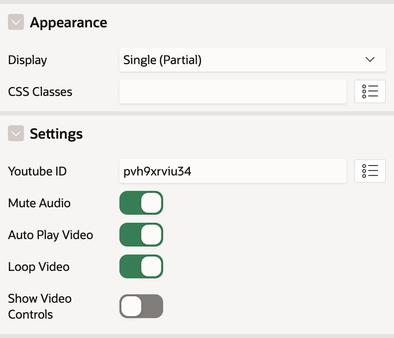
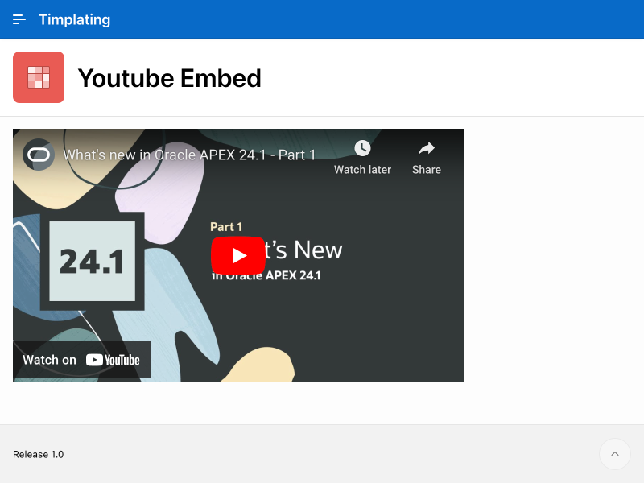

# Youtube Embed Template Component
A very simple Youtube Embed template component that allows you to display Youtube videos within an iframe by passing in the Youtube Video ID. This was built around the Oracle APEX 24.1 feature set allowing support for No Data source. This was also originally developed for Kscope 2024 conference with the Timplating session.

## Features
* Can be used as a partial for use inside of reports
* Ability to Mute audio, Auto Play, Loop and Show Media Controls
* Supports placement in the Hero Template Component to use as Back Drop

## Installation
Import template_component_plugin_youtube_embed.sql into your applicaiton.

## Sample Config

**Youtube Embed Template Component Attributes**

## Preview

## Demo
[Youtube Embed](https://apex.oracle.com/pls/apex/r/timplating/youtube-embed/)
